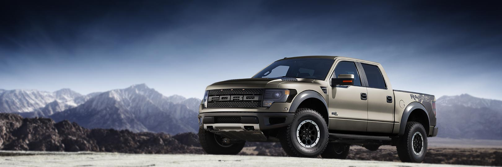
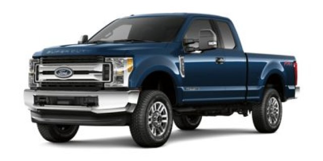
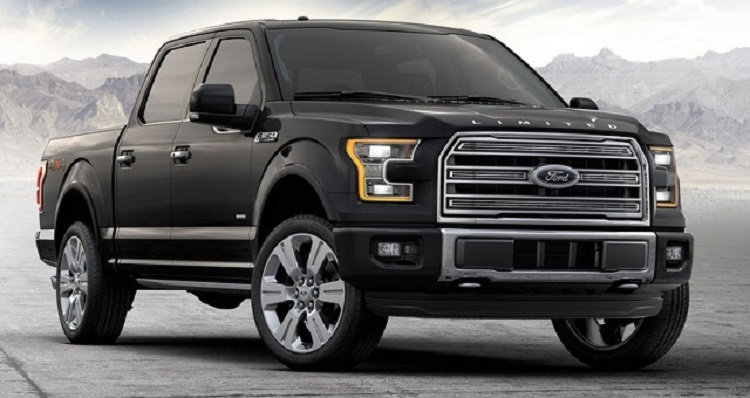
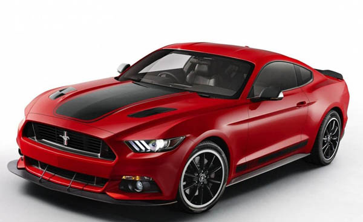
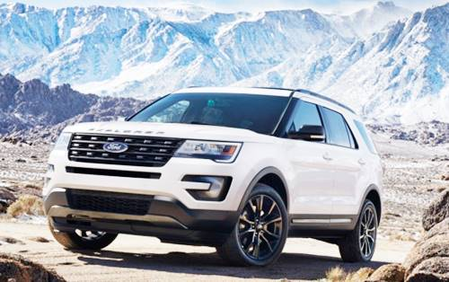

<!DOCTYPE html>
<html lang="en">
<head>
  <title>Mountain Ford Dealership</title>
  <meta charset="utf-8">
  <meta name="viewport" content="width=device-width, initial-scale=1">
  <link rel="stylesheet" href="https://maxcdn.bootstrapcdn.com/bootstrap/3.3.7/css/bootstrap.min.css">
  
  
  
</head>
<body>

    <!-- Indicators -->
    <ol class="carousel-indicators">
      <li data-target="#myCarousel" data-slide-to="0" class="active"></li>
      <li data-target="#myCarousel" data-slide-to="1"></li>
	  <li data-target="#myCarousel" data-slide-to="2"></li>
	  <li data-target="#myCarousel" data-slide-to="3"></li>
	  <li data-target="#myCarousel" data-slide-to="4"></li>
    </ol>

    <!-- Wrapper for slides -->
    

      

        
        

          <h3>32 Models on the Lot</h3>
          
Come Test Drive One Today

        

      

	  
	  

        
        

          <h3>22 Models on the Lot</h3>
          
Come Test Drive One Today

        

      

	  
	  

        
        

          <h3>17 Models on the Lot</h3>
          
Come Test Drive One Today

        

      

	  
      

        
        

          <h3>25 Models on the Lot</h3>
          
Come Test Drive One Today

        

      

    

    <!-- Left and right controls -->
    <a class="left carousel-control" href="#myCarousel" role="button" data-slide="prev">
      
      Previous
    </a>
    <a class="right carousel-control" href="#myCarousel" role="button" data-slide="next">
      
      Next
    </a>

<nav class="navbar navbar-inverse">
  

    

      <button type="button" class="navbar-toggle" data-toggle="collapse" data-target="#myNavbar">
        
        
        
      </button>
      
    

    

      <ul class="nav navbar-nav">
        <li class="active"><a href="#">Home</a></li>
        <li><a href="#">Onsite Vehicle Sales</a></li>
		<li><a href="#">Online Vehicle Sales</a></li>
        <li><a href="#">Service</a></li>
        <li><a href="#">Ford Home</a></li>
        <li><a href="#">Contact</a></li>
      </ul>
      <ul class="nav navbar-nav navbar-right">
        <li><a href="#"> Your Account</a></li>
      </ul>
    

  

</nav>

  

    

      

        
F250 TRUCKS

        

        
$32,535 Starting MSRP $472 Monthly Lease Fuel Economy based on fuel type/model Seating for 6 Click for more information

      

    

    

      

        
FOCUS

        

        
$17,225 Starting MSRP $189 Monthly Lease 26/36 EPA-Estimated MPG City/Hwy Seating for 5 Click for more information

      

    

    

      

        
FUSION

        

        
$22,120 Starting MSRP $199 Monthly Lease 21/32 EPA-Estimated MPG City/Hwy Seating for 5 Click for more information

      

    

  

 

  

    

      

        
F150 TRUCKS

        

        
$26,540 Starting MSRP $299 Monthly Lease 18/25EPA-Estimated MPG City/Hwy Seating for 6 Click for more information

      

    

    

      

        
MUSTANGS

        

        
$24,915 Starting MSRP $303 Monthly Lease 18/27 EPA-Estimated MPG City/Hwy Seating for 4 Click for more information

      

    

    

      

        
EXPLORER

        

        
$31,660 Starting MSRP $332 Monthly Lease 17/24 EPA-Estimated MPG City/Hwy Seating for 7 Click for more information

      

    

  

  

  

    

      

        
TAKE OUR SURVEY

        

        
Help us better serve you by taking our survey.

      

    

    

      

        
CONTACT ONLINE SALES

        
Online Sales: Thomas Harvey Phone: 687-987-5678 Email: ThomasHarveyFord@gmail.com 
			Online Sales: Bonnie Smith Phone: 687-987-5664 Email: BonnieSmithFord@gmail.com  Email: OnlineSalesFord@gmail.com

        
Online Sales Open 24/7

      

    

    

      

        
IN THE NEWS

        

        
See what is being said about us in the media and press.

      

    

  

 

<footer class="container-fluid text-center">
  
Online Store Copyright

  <form class="form-inline">To be contacted by a sales associate:
    <input type="email" class="form-control" size="50" placeholder="Email Address">
    <button type="button" class="btn btn-danger">Contact Me</button>
  </form>
</footer>

</body>
</html>

